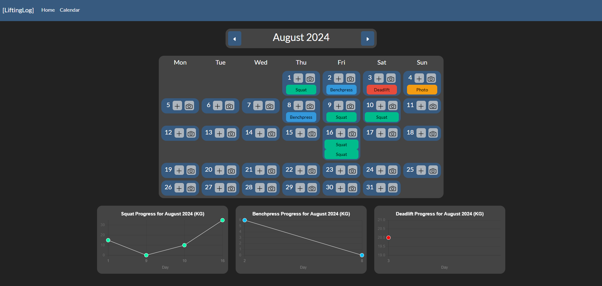

# Lifting Log WebApp

## About
An example fullstack webapp that allows you to record compound exercises and photos on a calendar and view progress in your exercises as graphs. 
Uses React for frontend with Typescript, and Express and MongoDB for the backend.

## Installation
Clone the repo + install packages in the frontend (client) and backend (api) folders:
```sh
$ git clone https://github.com/benjack795/LiftingLog.git
$ cd LiftingLog
$ cd client
$ npm install --force
$ cd ../api
$ npm install --force
```

## Commands
(Make sure you run each of these commands in a separate terminal) 
In the api folder, run `npm run devStart` to launch the backend server.
In the client folder, run `npm start` to start the site. It should then open in a new tab.
If you want to run the jest unit tests, run `npm test a` in the client folder. 
If you want to run the cypress end to end tests, run `npx cypress open` to open the cypress environment.

## Tutorial
From the home page, you can click Calendar to go to the main functional portion of the site.
From there, you can add either add exercises with the plus buttons or photos with the camera buttons for each day.
Exercises added will be updated onto the relevant graphs at the base of the page.


